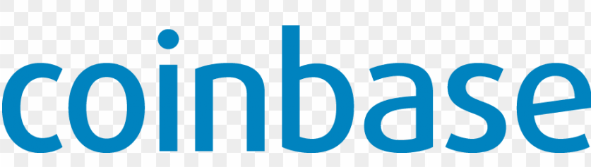

# Coinbase Case Study
A cryptocurrency company 

* Name of company
    * Coinbase

* When was the company incorporated?
    * 2012

* Who are the founders of the company?
    * Brian Armstrong
    

* How did the idea for the company (or project) come about?
   
    -  The founder believed that the financial system is inefficient, not improving, and holding back innovation. 
    - In 2010, the founder came across a paper on the internet (Bitcoin: A Peer-to-Peer Electronic Cash System) by Satoshi Nakamoto, where he liked the idea that the internet can move money around the world. He believd that this idea can make the financial system more fair, efficient and open to all people, so he started to program Coinbase 

* How is the company funded? How much funding have they received?
    - In 2011, Coinbase enrolled in the summer 2012 Y combinator startup incubator program 
    - In May 2013, Coinbase received $5 million Series A investment led by Fred Wilson from the venture capital firm Union Square Ventures

## Business Activities:

* What specific financial problem is the company or project trying to solve?
    - Financial efficiency and economic freedom by using cryptocurrency and smartphone revolution to inject economic freedom all over the world
            
         - Economic freedom examples:
            1. Cryptocurrency gives people wealth that cannot be taken away from them by having property rights using controlled wallets and brain wallets
            2. Cryptocurrency provides free trade by enabling cross-border payments
            3. Currency stability

* Who is the company's intended customer?  Is there any information about the market size of this set of customers?
    - Merchants and consumers. Coinbase is based in San Francisco, California, and has more than 30 million users with more than $150 billion traded.

-   **What solution does this company offer that their competitors do not or cannot offer? (What is the unfair advantage they utilize?)** 
   
     - Coinbase offers scheduled transactions service
    - Coinbase has an "Instant Buy" option available with debit card
    - Coinbase enjoys liquidity and a great number of users which makes them a good platform for starters and this is caused by the "rich get richer" effect

* Which technologies are they currently using, and how are they implementing them? (This may take a little bit of sleuthing–– you may want to search the company’s engineering blog or use sites like Stackshare to find this information.)
    - Products that make up Coinbase’s tech stack include: Android Wear SDK, Authy, Bootstrap, Busnag, Cloudinary, CloudFlare, DigiCert, Emailage, Evident. io, Fastly, Google (Cloud Messaging, Maps), HackerOne, Iron. io Enterprise, IronMQ, JavaScript, MarkMonitor Domain Management, MongoDB, New Relic, nginx, Node.js, PostgreSQL, Redis, Ruby, Ruby on Rails, reCAPTCHA, and Sakurity. 
    - Additionally, here’s a list of other software products that Coinbase is using internally:
        - Marketing: Amazon SES, Google (Apps for Work, Tag Manager), Segment
        - Sales and Support: Base CRM, Olark, Salesforce Desk.com
        - Analytics: AWS Kinesis, D3js, Google Analytics, Mixpanel
        - HR: AngelList Jobs, Culture Amp, Greenhouse
        - Finance and Accounting: Emburse, BlockCypher, Sift Science, Square
        - Productivity: Clerky, FireEye, Google (Drive, Fit SDK), Managed By Q 
            > 

## Landscape:

* What domain of the financial industry is the company in?
    - Cryptocurrency exchange
* What have been the major trends and innovations of this domain over the last 5-10 years?
  -   Bitcoin halving
        - Bitcoin (BTC) is the leading cryptocurrency and the use of halving is to stabilize the supply of bitcoins as it approaches full saturation and there are no more bitcoins to be mined
            - In 2012, the first Bitcoin halving took place to reduce mining rewards to 25 BTC
            -  In 2016, the second halving reduced mining rewards down to 12.5 BTC
            - In 2020, the third halving is expected to take place in May. The mining reward will fall to 6.25 BTC
    - Libra
        - A reliable and secure blockchain that will be launched by Facebook in Summer 2020
            - Libra main features:
                - A stablecoin which is backed by a reserve of assets
                - Governed by the independent Libra Association
                - Uses the LibraBFT consensus mechanism
                - Smart contract coding is done through “Move” programming language
    - Government regulation 
        - In June 2015, New York regulated blockchain companies through state agency rulemaking.
        - In 2019, 32 states  introduced laws to accept or to promote the usage of blockchain distributed ledger technology (DLT), where as some other states have already passed them into effective laws. 

* What are the other major companies in this domain?
    - Xapo
        - A cryptocurrency company based in Hong Kong that provides bitcoin wallet services
    - Blockchain.com
        - a cryrptocurrency wallet and a Bitcoin block explorer based in Luxembourg
    - Kraken
        - a cryptocurrency exchange company based in the United States
    - Binance
    - Huobi
    

## Results

* What has been the business impact of this company so far?
    - Providing a secured platform for cyprtocurrency exchange, which is easy to use especially for first time buyers. It offers different options for payments including Paypal, debit card, credit card, or bank transfers. This resulted in gaining more than 30 million users. 

* What are some of the core metrics that companies in this domain use to measure success? How is your company performing, based on these metrics?
    - Number of users
        - Coinbase has the greatest number of users compared to its competitors
    - Security
        - Security is essential to gain the trust of users. Coinbase is considered the most trusted cryptocurrency platform

    - Payment methods
        - Company that offers various payment methods would gain more users who might prefer different payment options. Coibase offers different options for payments including Paypal, debit card, credit card, or bank transfers.

* How is your company performing relative to competitors in the same domain?
    - Coinbase has the largest number of users in comparison to its competitors. It has more than 30 million users and it has been growing by adding more than 8 million new users in the past two years

## Recommendations

* If you were to advise the company, what products or services would you suggest they offer? (This could be something that a competitor offers, or use your imagination!)
    - Add an alternative platform for peer-to-peer (P2P) exchanges to provide people who prefer more freedom regarding the purchase price and different ways of payments. As P2P platforms are growing rapidly,  Coinbase will lose their market share.

* Why do you think that offering this product or service would benefit the company?
   - Exposes them to more users around the world.
* What technologies would this additional product or service utilize?
    - Peer-to-peer exchange with escrow services.
* Why are these technologies appropriate for your solution?
    - Coinbase is not supported in every country, having peer-to-peer will allow users who are not residents of the supported countries or those who prefer more freedom to use this platform.

Resources:
1. https://www.businessinsider.com/blockchain-cryptocurrency-regulations-us-global
2. https://www.cfo.com/payments/2019/12/the-5-biggest-trends-in-cryptocurrency-for-2020/
3. https://medium.com/wave-financial/the-alpha-framework-an-analysis-of-the-coinbase-effect-585a6e2f3a13
4. https://en.bitcoinwiki.org/wiki/CoinBase
5. Cointbase.com 
6. https://blockgeeks.com/guides/understanding-facebooks-cryptocurrency-libra/
7. https://www.ncsl.org/research/financial-services-and-commerce/blockchain-2019-legislation.aspx

### Company Website
[Company Website](https://www.coinbase.com)

